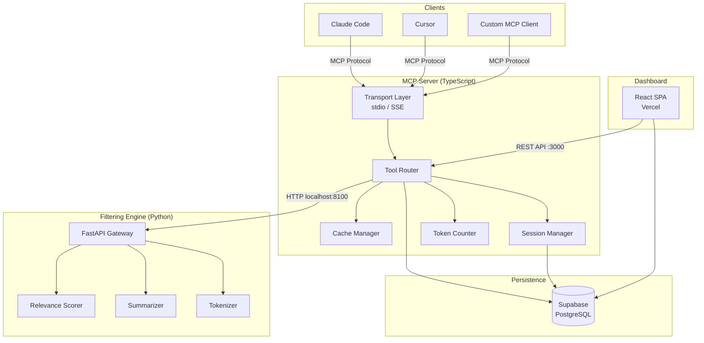
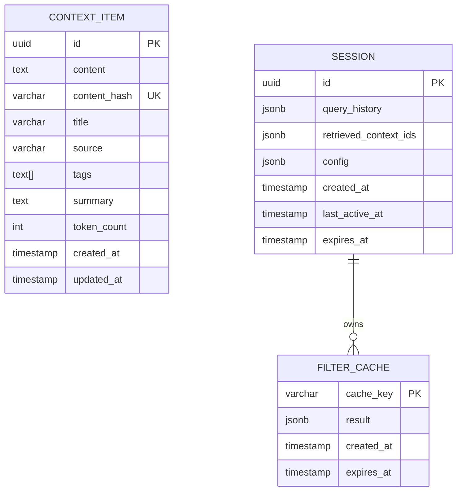

# Design: Lazy Context Filtering MCP Server

## Overview
A two-process MCP server: a TypeScript process handles the MCP protocol, tool routing, caching, and client communication; a Python process runs the filtering/scoring engine. They communicate via local HTTP (FastAPI). Supabase provides persistence. A React dashboard on Vercel provides configuration and analytics.

## Architecture



## Components and Interfaces

### TypeScript MCP Server (`src/server/`)

| Component | Responsibility |
|---|---|
| `index.ts` | Entry point, transport selection, server initialization |
| `tools/register.ts` | `register_context` tool — validates, hashes, stores context |
| `tools/list.ts` | `list_context` tool — returns metadata/summaries |
| `tools/get.ts` | `get_context` tool — returns full content by ID |
| `tools/filter.ts` | `filter_context` tool — delegates scoring to Python engine, applies token budget |
| `tools/session.ts` | `create_session`, `end_session` tools |
| `cache.ts` | In-memory LRU cache with TTL and invalidation |
| `session.ts` | Session lifecycle, expiry timer, history tracking |
| `token-counter.ts` | Token counting (delegates to Python for accuracy) |
| `db.ts` | Supabase client, fallback to in-memory store |
| `api.ts` | Express routes for dashboard REST API |

### Python Filtering Engine (`src/engine/`)

| Component | Responsibility |
|---|---|
| `main.py` | FastAPI app, health check, CORS |
| `scorer.py` | Relevance scoring — TF-IDF baseline + optional embedding-based scoring |
| `filter.py` | Orchestrates scoring, threshold filtering, budget packing |
| `tokenizer.py` | Token counting per model family (tiktoken for OpenAI, approximation for Claude) |
| `summarizer.py` | Generates one-line summaries for lazy loading |
| `cache.py` | Result caching with hash-based keys |
| `models.py` | Pydantic models for request/response schemas |

### Key Interfaces

```typescript
// Context item stored in the system
interface ContextItem {
  id: string;           // UUID
  content: string;
  contentHash: string;  // SHA-256 for dedup
  metadata: {
    title?: string;
    source?: string;
    tags: string[];
    createdAt: string;
    updatedAt: string;
  };
  summary: string;      // Generated by Python engine
  tokenCount: number;   // Pre-computed
}

// Filter request
interface FilterRequest {
  query: string;
  sessionId?: string;
  tokenBudget?: number;
  minScore?: number;
  modelFamily?: 'claude' | 'gpt4' | 'generic';
  limit?: number;
}

// Filter response
interface FilterResult {
  items: ScoredContextItem[];
  totalTokens: number;
  cached: boolean;
  sessionId?: string;
}

interface ScoredContextItem {
  id: string;
  score: number;        // 0.0 - 1.0
  summary: string;
  tokenCount: number;
  truncated: boolean;
  content?: string;     // Only if within budget
}
```

```python
# Python engine API schemas
class ScoreRequest(BaseModel):
    query: str
    items: list[ContextItemPayload]
    session_history: list[str] = []

class ScoreResponse(BaseModel):
    scored_items: list[ScoredItem]
    processing_time_ms: float

class ScoredItem(BaseModel):
    id: str
    score: float  # 0.0 - 1.0
    summary: str
    token_count: int
```

## Data Models



### Supabase Tables

| Table | Indexes |
|---|---|
| `context_items` | PK on `id`, unique on `content_hash`, GIN on `tags` |
| `sessions` | PK on `id`, index on `expires_at` |
| `filter_cache` | PK on `cache_key`, index on `expires_at` |

## API Design

### MCP Tools (exposed via MCP protocol)

| Tool | Input | Output |
|---|---|---|
| `register_context` | `{ content, metadata?, tags? }` | `{ id, contentHash, summary, tokenCount }` |
| `list_context` | `{ tags?, limit?, offset? }` | `{ items: [{ id, summary, metadata, tokenCount }], total }` |
| `get_context` | `{ ids: string[] }` | `{ items: [{ id, content, metadata }] }` |
| `filter_context` | `{ query, sessionId?, tokenBudget?, minScore?, modelFamily? }` | `{ items: ScoredContextItem[], totalTokens, cached }` |
| `create_session` | `{ config? }` | `{ sessionId, expiresAt }` |
| `end_session` | `{ sessionId }` | `{ success: true }` |

### Dashboard REST API (Express, port 3000)

| Endpoint | Method | Purpose |
|---|---|---|
| `/api/status` | GET | Server health, context count, active sessions |
| `/api/context` | GET | List all context items with pagination |
| `/api/context/:id` | DELETE | Remove a context item |
| `/api/sessions` | GET | List active sessions |
| `/api/config` | GET/PUT | Read/update server config (thresholds, TTL) |
| `/api/analytics` | GET | Token usage stats per session |

### Python Engine API (FastAPI, port 8100)

| Endpoint | Method | Purpose |
|---|---|---|
| `/health` | GET | Engine health check |
| `/score` | POST | Score context items against a query |
| `/summarize` | POST | Generate summary for a context item |
| `/tokenize` | POST | Count tokens for given text and model family |

## Error Handling Strategy

| Error Class | HTTP/MCP Code | Behavior |
|---|---|---|
| Invalid input | 400 / MCP InvalidParams | Return validation errors, do not retry |
| Context not found | 404 / MCP InvalidParams | Return not-found with the missing ID |
| Session expired | 410 / MCP InvalidParams | Return session-expired, client creates new session |
| Engine unavailable | 503 / MCP InternalError | Return degraded-mode warning, serve from cache if available |
| Size limit exceeded | 413 / MCP InvalidParams | Return max size in error message |
| Rate limit | 429 | Return retry-after header |

## Testing Strategy

| Layer | Framework | Coverage Target |
|---|---|---|
| TS unit tests | Vitest | 80%+ |
| TS integration tests | Vitest + supertest | MCP protocol compliance |
| Python unit tests | pytest | 80%+ |
| Python integration tests | pytest + httpx | Engine API contract |
| E2E | Vitest | Full MCP client → server → engine flow |

## Security Architecture

| Threat | Vector | Mitigation |
|---|---|---|
| Content injection | Malicious context content | Input sanitization, size limits |
| DoS via large payloads | Oversized context registration | 100KB limit, rate limiting |
| Session hijacking | Guessing session IDs | UUID v4 (122 bits entropy) |
| Data exfiltration | Unauthorized dashboard access | Dashboard behind auth (future) |
| Secret exposure | Env vars in logs | Never log env var values, structured logging |

### ADR-1: TypeScript + Python Hybrid Architecture

**Status:** Accepted
**Context:** MCP SDK is TypeScript-first. NLP/ML scoring is Python-first. Need both.
**Options Considered:**
- Option A: Pure TypeScript — Pro: single runtime. Con: limited NLP libraries, no tiktoken native.
- Option B: Pure Python — Pro: rich ML ecosystem. Con: MCP SDK is less mature in Python.
- Option C: Hybrid TS + Python — Pro: best of both. Con: inter-process communication overhead.
**Decision:** Option C. TS handles protocol, Python handles scoring. Communication via local HTTP (FastAPI).
**Consequences:** Requires running two processes. Docker Compose simplifies local dev. Latency adds ~5-20ms per scoring call.

### ADR-2: Local HTTP vs Subprocess for TS-Python Communication

**Status:** Accepted
**Context:** TS server needs to call Python engine.
**Options Considered:**
- Option A: HTTP (FastAPI) — Pro: standard, debuggable, independent scaling. Con: network overhead.
- Option B: Subprocess + stdin/stdout — Pro: no network. Con: harder to debug, no independent scaling.
- Option C: gRPC — Pro: efficient binary protocol. Con: overkill for local communication.
**Decision:** Option A. FastAPI on localhost:8100. Simple, debuggable, independently deployable.
**Consequences:** Small latency overhead acceptable for the simplicity gained.

### ADR-3: Scoring Algorithm — TF-IDF Baseline

**Status:** Accepted
**Context:** Need relevance scoring that works without external API calls.
**Options Considered:**
- Option A: TF-IDF only — Pro: fast, no dependencies, works offline. Con: no semantic understanding.
- Option B: Embedding-based (sentence-transformers) — Pro: semantic similarity. Con: model download, GPU helpful.
- Option C: TF-IDF baseline + optional embeddings — Pro: works out of box, upgradeable. Con: two code paths.
**Decision:** Option C. TF-IDF ships by default. Embedding scorer as optional plugin when `sentence-transformers` is installed.
**Consequences:** Default experience is fast and dependency-light. Power users can opt into embeddings.

## Scalability and Performance

| Metric | Target |
|---|---|
| Filter latency (1000 items, TF-IDF) | < 500ms |
| Filter latency (1000 items, embeddings) | < 2s |
| Cache hit response time | < 10ms |
| Concurrent sessions | 100+ |
| Context items per instance | 10,000+ |

**Bottleneck:** Python scoring engine is CPU-bound. Mitigation: caching, async FastAPI, optional batching.

## Dependencies and Risks

| Risk | Likelihood | Impact | Mitigation |
|---|---|---|---|
| MCP SDK breaking changes | Medium | High | Pin SDK version, monitor releases |
| Python engine crash | Low | High | Health checks, auto-restart via PM2/Docker |
| Supabase downtime | Low | Medium | In-memory fallback mode |
| Token counting drift | Medium | Low | Validate against official tokenizers periodically |
