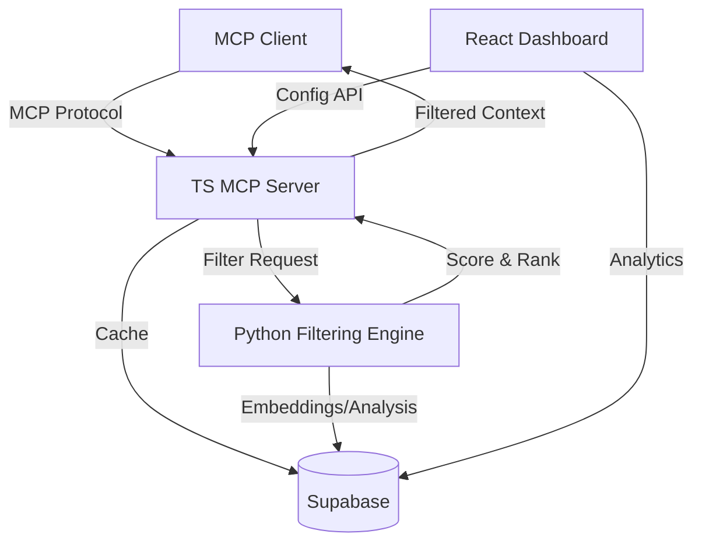

# Plan: Lazy Context Filtering MCP Server

## Goal
Build an MCP (Model Context Protocol) server that provides intelligent, lazy context filtering for LLM-powered applications. The server intercepts and filters context before it reaches the LLM, reducing token consumption, improving response relevance, and enabling smarter context management across sessions.

## Problem Statement
LLM applications often send excessive or irrelevant context to models, wasting tokens and degrading response quality. Current approaches either send everything (expensive, noisy) or require manual curation (slow, brittle). This server sits between the client and the LLM to automatically filter, prioritize, and lazily load context on demand.

## Tech Stack
| Layer | Technology | Rationale |
|---|---|---|
| MCP Protocol Layer | TypeScript + @modelcontextprotocol/sdk | Official SDK, first-class MCP support |
| Filtering Engine | Python | Rich NLP/ML ecosystem for text analysis |
| Database | Supabase (PostgreSQL) | Context caching, session persistence |
| Frontend Dashboard | TypeScript/React | Configuration UI, analytics |
| Frontend Hosting | Vercel | Zero-config React deployment |
| Backend Hosting | Render | Docker-based Python/Node services |
| CI/CD | GitHub Actions | Integrated with GitHub repo |

## Architecture Overview



## Key Concepts
- **Lazy Loading**: Context is not loaded until explicitly needed — summaries and metadata are sent first, full content on demand
- **Relevance Scoring**: Each context item gets a relevance score based on the current query/task
- **Token Budget**: Clients specify a token budget; the server fills it with the highest-scoring context
- **Session Awareness**: Context filtering adapts based on conversation history
- **Caching**: Previously filtered results are cached to avoid recomputation

## File Structure
```
lazy-context-filtering-mcp/
├── .claude/                    # Claude Code config (junctions to kit)
├── .github/                    # GitHub Actions, Copilot instructions
├── .spec/                      # Planning artifacts
├── src/
│   ├── server/                 # TypeScript MCP server
│   │   ├── index.ts            # Entry point
│   │   ├── tools/              # MCP tool definitions
│   │   ├── resources/          # MCP resource definitions
│   │   └── transport/          # Transport layer (stdio, SSE)
│   ├── engine/                 # Python filtering engine
│   │   ├── __init__.py
│   │   ├── scorer.py           # Relevance scoring
│   │   ├── filter.py           # Context filtering logic
│   │   ├── tokenizer.py        # Token counting/budget
│   │   └── cache.py            # Caching layer
│   └── dashboard/              # React frontend (optional)
│       ├── src/
│       └── package.json
├── tests/
│   ├── server/                 # TS server tests
│   └── engine/                 # Python engine tests
├── package.json                # TS dependencies
├── tsconfig.json
├── pyproject.toml              # Python dependencies
├── Dockerfile
└── docker-compose.yml
```

## Constraints
- MCP protocol compliance required (tools, resources, prompts)
- Must support both stdio and SSE transports
- Python engine communicates with TS server via local HTTP or subprocess
- Token counting must be accurate per model family
- All secrets via environment variables, never hardcoded
